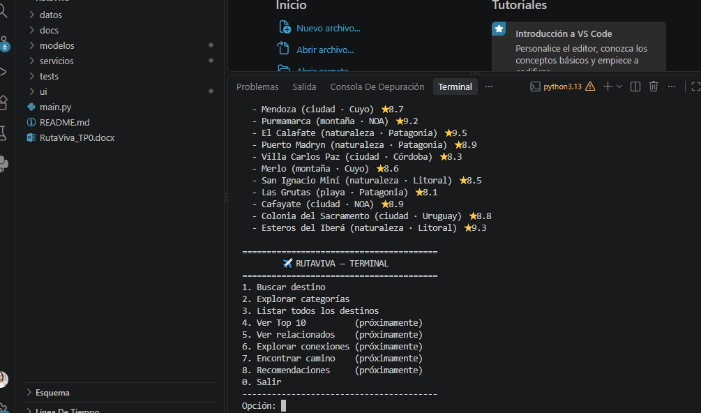

# RutaViva ✈️

Sistema de recomendación de destinos de viaje — TP Integrador de Estructuras de Datos.  
**Estado actual:** TP1 — Objetos y clases

---

## Puntos Desarrollados en esta Entrega

### 1. Ampliación del Dataset
Se expandió la base de datos de la aplicación en `datos/destinos.json`, incorporando un total de **25 destinos turísticos** con su respectiva categoría, región, rating y descripción.

### 2. Pruebas Automatizadas
Se creó la carpeta `tests/` y el módulo `tests/test_catalogo.py` con 5 pruebas unitarias (`unittest`) para validar:
- Búsqueda por nombre exacto.
- Búsqueda sin distinción de mayúsculas/minúsculas.
- Manejo de destinos inexistentes.
- Listado completo de destinos.
- Filtrado correcto por categoría.

### 3. Casos de Uso
Se documentó el análisis funcional en la carpeta `docs`:
- [docs/02-casos-de-uso.md](docs/02-casos-de-uso.md)

### 4. Diagrama de Clases
Se estructuró el diagrama UML de las clases de dominio y catálogo utilizando la sintaxis de Mermaid:
- [docs/03_diagrama_clases.md](docs/03_diagrama_clases.md)

### 5. Documentación General (README)
Se completó la documentación del repositorio reflejando el progreso de los 6 puntos solicitados para la entrega del TP1.

### 6. Demostración de Ejecución (Demo)
A continuación se adjunta la captura de pantalla de la terminal con el menú funcional ejecutándose:



---

## Guía de Ejecución

### Requisitos
- Requiere Python 3.10+ (sin dependencias externas).

### Ejecutar las Pruebas Automatizadas
```bash
python -m unittest discover tests
