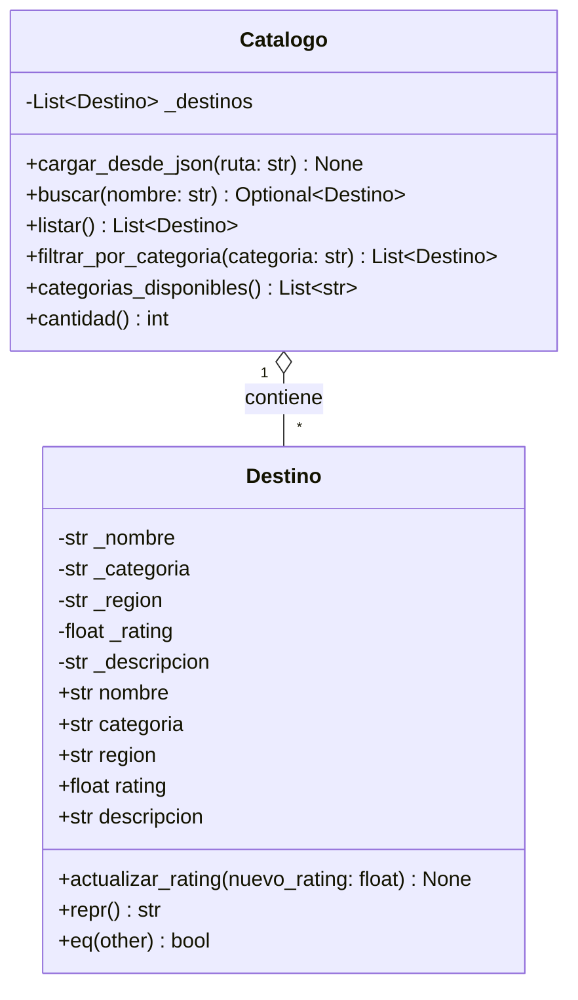

# Diagrama de Clases

```mermaid
classDiagram

class Destino {
    -str _nombre
    -str _categoria
    -str _region
    -float _rating
    -str _descripcion

    +str nombre
    +str categoria
    +str region
    +float rating
    +str descripcion

    +actualizar_rating(nuevo_rating: float) None
    +repr() str
    +eq(other) bool
}

class Catalogo {
    -List~Destino~ _destinos

    +cargar_desde_json(ruta: str) None
    +buscar(nombre: str) Optional~Destino~
    +listar() List~Destino~
    +filtrar_por_categoria(categoria: str) List~Destino~
    +categorias_disponibles() List~str~
    +cantidad() int
}

Catalogo "1" o-- "*" Destino : contiene
```
